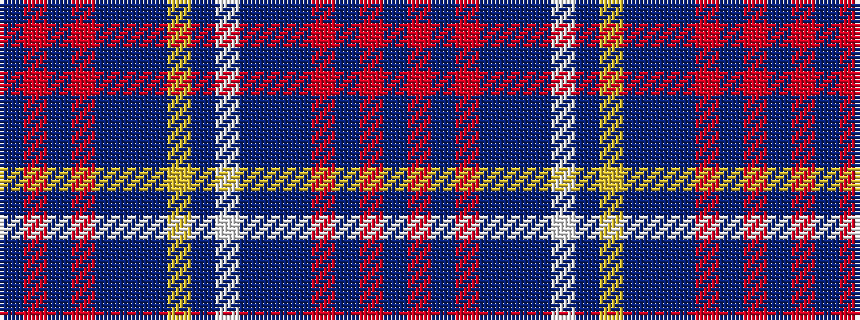

BRBRBBBWBYBBBRBRB

It is a 17 stripe tartan.

<figure class="pat-woven">

<figcaption>idealised sample</figcaption>
</figure>

## Colour Sequence



## Tartans with this colour sequence

| Tartans |
|---------------|
| [Great Glen (Fashion)](/setts/s17/dt5o4dt4o38n34dt4n4lb2n2ly2n4dt4n34o38dt4o4dt2/)|
||
