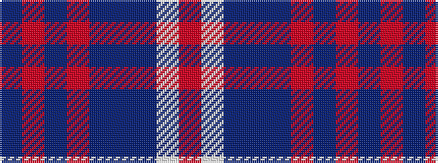

BRBRBBBWR

It is a 9 stripe tartan.

<figure class="pat-woven">

<figcaption>idealised sample</figcaption>
</figure>

## Colour Sequence



## Tartans with this colour sequence

| Tartans |
|---------------|
| [Glasgow Clyde College](/variants/s9/t48r1db10r1t10n2db27w1m3~x2/)|
||
