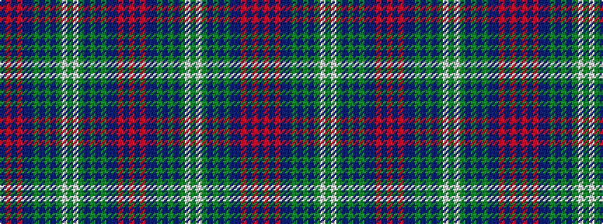

BRBRBBGBGBGWGWGBGBGBBRBR

It is a 24 stripe tartan.

<figure class="pat-woven">

<figcaption>idealised sample</figcaption>
</figure>

## Colour Sequence



## Tartans with this colour sequence

This pattern is a design lineage: every tartan below shares one colour order, whatever its owner —
near-identical designs are grouped, the largest lineage first (#112: the pattern is a tartan's
second parent, beside its family or clan).

<table class="sett-table">
<tbody>
<tr><td><a href="/variants/s24/n10r2n2r2n2ni5y25db6y2db2y1lb3y3lb3y11db2y2db6y25ni5n2r2n2r2~x2~ni1700000-y2400000/">LOOK Keith</a></td></tr>
<tr><td class="sett-swatch"></td></tr>
</tbody>
</table>

