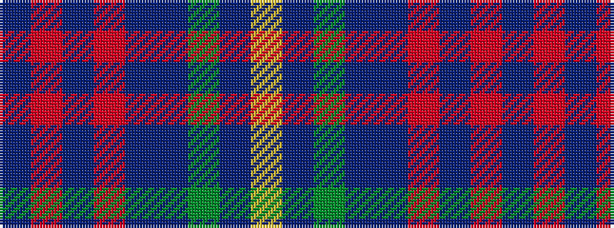

BRBRBBGBY

It is a 9 stripe tartan.

<figure class="pat-woven">

<figcaption>idealised sample</figcaption>
</figure>

## Colour Sequence



## Tartans with this colour sequence

| Tartans |
|---------------|
| [Ayrshire Tourist Board](/setts/s9/db10m3b4m3db7b3g7db17ly2~x2/)|
||
