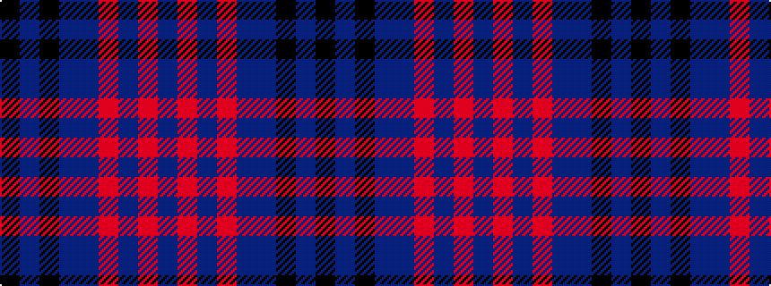

BRBRBBKBK

It is a 9 stripe tartan.

<figure class="pat-woven">

<figcaption>idealised sample</figcaption>
</figure>

## Colour Sequence



## Tartans with this colour sequence

| Tartans |
|---------------|
| [Scottish Monuments (Corporate)](/variants/s9/k3n6k2n8dt20o3dt2o2dt3~x2/)|
||
