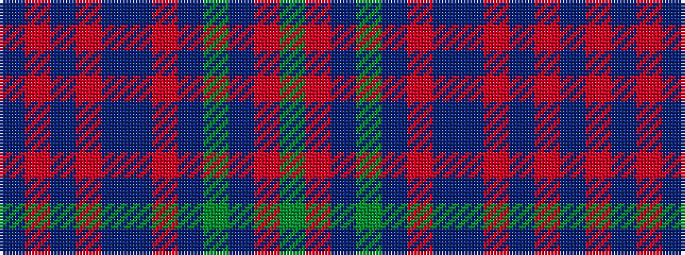

BRBRBBRBGBRG

It is a 12 stripe tartan.

<figure class="pat-woven">

<figcaption>idealised sample</figcaption>
</figure>

## Colour Sequence



## Tartans with this colour sequence

| Tartans |
|---------------|
| [Richards (Welsh Name)](/variants/s12/db5r2db2r2db2dt5r2dt1dg1dt1r10dg3~x4/)|
||
