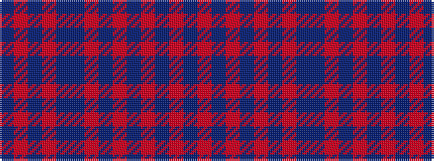

BRBRBBRBRBRBRB

It is a 14 stripe tartan.

<figure class="pat-woven">

<figcaption>idealised sample</figcaption>
</figure>

## Colour Sequence



## Tartans with this colour sequence

| Tartans |
|---------------|
| [Grant of Glenmoriston (Clan)](/setts/s14/db6r2db2r24db2r2db2r8db2db32r2db2r1db6~x2/)|
||
