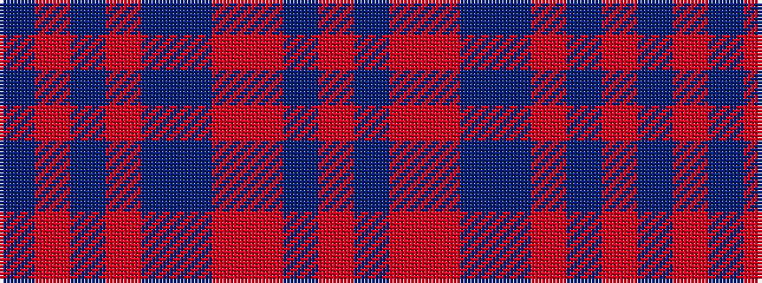

BRBRBBRRBR

It is a 10 stripe tartan.

<figure class="pat-woven">

<figcaption>idealised sample</figcaption>
</figure>

## Colour Sequence



## Tartans with this colour sequence

| Tartans |
|---------------|
| [Clyde](/setts/s10/o5n3o22r3n6ni17r2ni4r2ni4~x2/)|
||
