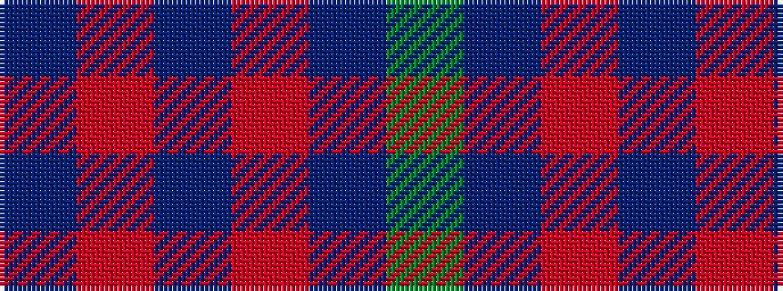

BRBRBG

It is a 6 stripe tartan.

<figure class="pat-woven">

<figcaption>idealised sample</figcaption>
</figure>

## Colour Sequence



## Tartans with this colour sequence

| Tartans |
|---------------|
| [Robbins](/tartans/db1r3db1r3db6g1/)|
||
| [Robbins Family Tartan Tartan Number: 412. Earliest known date: 1985 See products available Copyright © Blair Urquhart, Comrie, 2015](/setts/s6/db1m3db1m3db6g1~x4/)|
||
| [Royal and Ancient, The](/setts/s6/g49db16o3db2o2db6~x2/)|
||
