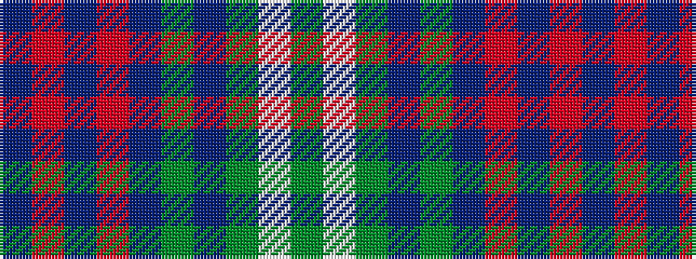

BRBRBGBGWG

It is a 10 stripe tartan.

<figure class="pat-woven">

<figcaption>idealised sample</figcaption>
</figure>

## Colour Sequence



## Tartans with this colour sequence

| Tartans |
|---------------|
| [Bell of Ardbel (Personal)](/setts/s10/do7r4do4r25dp1y32dp4y2w2y5~x2/)|
||
| [Bell, John](/setts/s10/dr7m4dr4m25p1dy32p4dy2w2dy5~x2/)|
||
