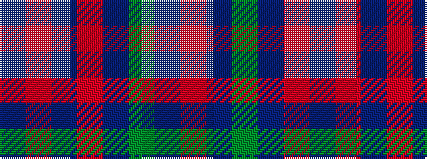

BRBRBGBR

It is a 8 stripe tartan.

<figure class="pat-woven">

<figcaption>idealised sample</figcaption>
</figure>

## Colour Sequence



## Tartans with this colour sequence

| Tartans |
|---------------|
| [Loretto School](/variants/s8/db4r14dp6r5db12dg8db70m4/)|
||
