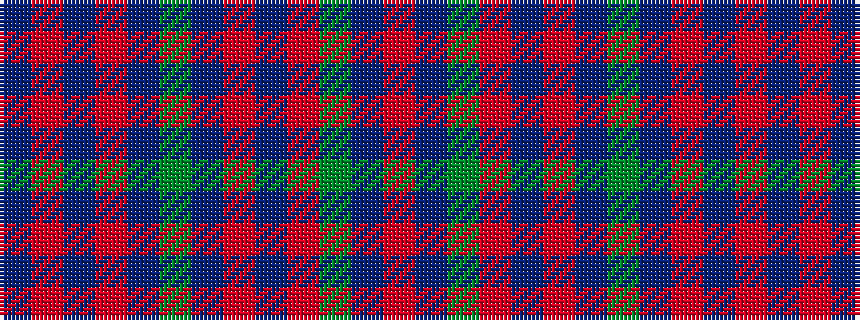

BRBRBGBRBRGBR

It is a 13 stripe tartan.

<figure class="pat-woven">

<figcaption>idealised sample</figcaption>
</figure>

## Colour Sequence



## Tartans with this colour sequence

| Tartans |
|---------------|
| [Great Dane, The](/setts/s13/db6r30db6r30db6g6db6r6db15r2g10db15r2/)|
||
