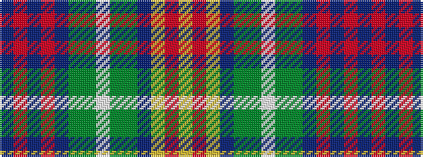

BRBRBGGWGGBYRY

It is a 14 stripe tartan.

<figure class="pat-woven">

<figcaption>idealised sample</figcaption>
</figure>

## Colour Sequence



## Tartans with this colour sequence

| Tartans |
|---------------|
| [Allen - 2001 (Personal)](/setts/s14/dt16r2dt3r4dt2dy12g18w2g18dy12dt12ly2r2ly2~x2/)|
||
