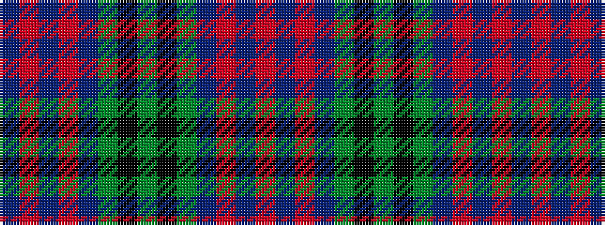

BRBRBGKGKGBRBR

It is a 14 stripe tartan.

<figure class="pat-woven">

<figcaption>idealised sample</figcaption>
</figure>

## Colour Sequence



## Tartans with this colour sequence

| Tartans |
|---------------|
| [Greenlaw, American](/setts/s14/b46r2b3r2b14g38k3g4~x2/)|
||
