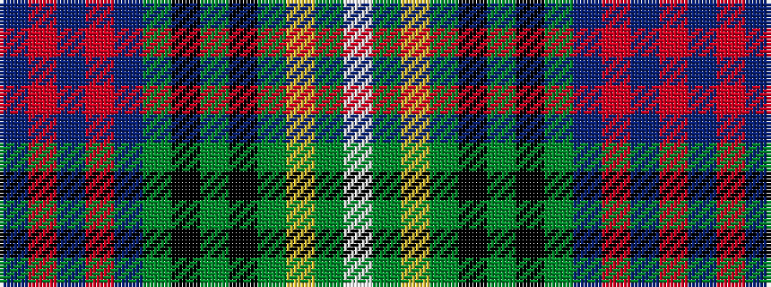

BRBRBGKGKGYGW

It is a 13 stripe tartan.

<figure class="pat-woven">

<figcaption>idealised sample</figcaption>
</figure>

## Colour Sequence



## Tartans with this colour sequence

| Tartans |
|---------------|
| [McCrann, Julian David (Personal)](/variants/s13/db8r2db2r4db8y2k10y10k4y2ly2y4w1~x2/)|
||
