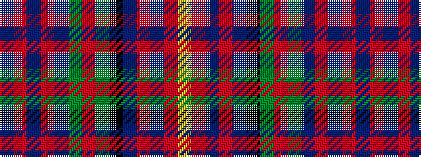

BRBRBGRGKBRBRY

It is a 14 stripe tartan.

<figure class="pat-woven">

<figcaption>idealised sample</figcaption>
</figure>

## Colour Sequence



## Tartans with this colour sequence

| Tartans |
|---------------|
| [Hyndman (Omagh)](/setts/s14/db8r4db6r10db24dg12o4dg4k4db18r10db4r6lr3/)|
||
