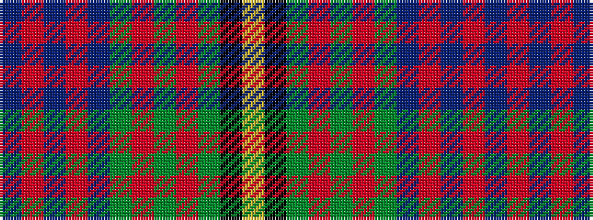

BRBRBGRGRGKY

It is a 12 stripe tartan.

<figure class="pat-woven">

<figcaption>idealised sample</figcaption>
</figure>

## Colour Sequence



## Tartans with this colour sequence

| Tartans |
|---------------|
| [Law of Heather Athol (Personal)](/variants/s12/db6r2db2r4db24g11r4g2r2g3k1ly2~x2/)|
||
