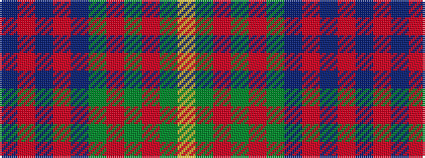

BRBRBGRGRGY

It is a 11 stripe tartan.

<figure class="pat-woven">

<figcaption>idealised sample</figcaption>
</figure>

## Colour Sequence



## Tartans with this colour sequence

| Tartans |
|---------------|
| [Law of Atholl (Personal)](/setts/s11/db10r3db3r6db26g12r6g2r3g6lo2~x2/)|
||
