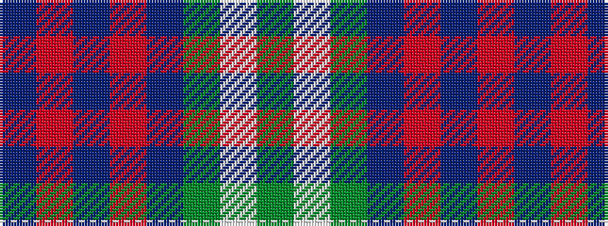

BRBRBGWG

It is a 8 stripe tartan.

<figure class="pat-woven">

<figcaption>idealised sample</figcaption>
</figure>

## Colour Sequence



## Tartans with this colour sequence

| Tartans |
|---------------|
| [MacAuliffe/McAucliffe](/setts/s8/dg38w2dg6db24o6db2o3db2~x2/)|
||
