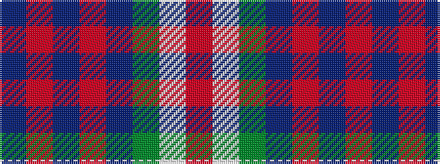

BRBRBGWR

It is a 8 stripe tartan.

<figure class="pat-woven">

<figcaption>idealised sample</figcaption>
</figure>

## Colour Sequence



## Tartans with this colour sequence

| Tartans |
|---------------|
| [Idaho, Centennial](/variants/s8/db12r2db2r2db2g10w12o3~x2/)|
||
