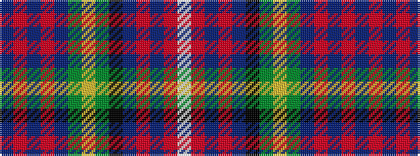

BRBRBGYGKBRBRW

It is a 14 stripe tartan.

<figure class="pat-woven">

<figcaption>idealised sample</figcaption>
</figure>

## Colour Sequence



## Tartans with this colour sequence

| Tartans |
|---------------|
| [Hyndman (Name)](/setts/s14/b4r2b3r4b8g4ly2g2k2b6r4b2r2w2~x4/)|
||
