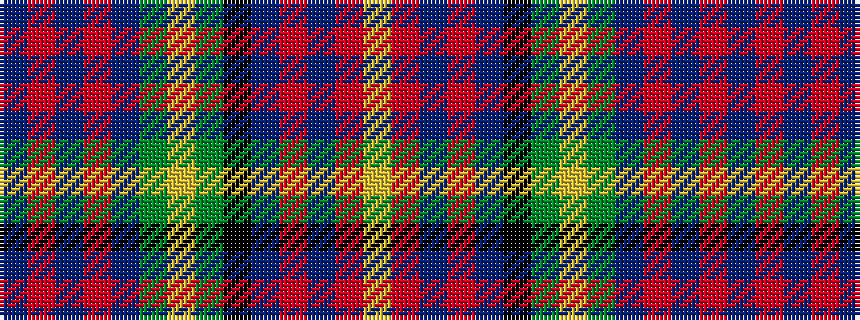

BRBRBGYGKBRBRY

It is a 14 stripe tartan.

<figure class="pat-woven">

<figcaption>idealised sample</figcaption>
</figure>

## Colour Sequence



## Tartans with this colour sequence

| Tartans |
|---------------|
| [Hyndman Family Tartan](/variants/s14/dbi8ri4dbi6ri10dbi24dg12lo4dg4k4db18r10db4r6lr3/)|
||
