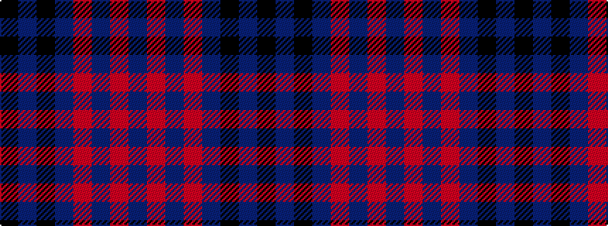

BRBRBKBK

It is a 8 stripe tartan.

<figure class="pat-woven">

<figcaption>idealised sample</figcaption>
</figure>

## Colour Sequence



## Tartans with this colour sequence

| Tartans |
|---------------|
| [Balmoral Hotel](/variants/s8/dt17o2dt2o2dt2k17db13k4~x2/)|
||
