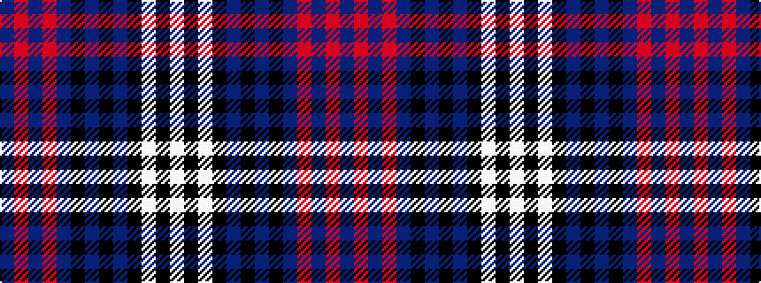

BRBRBKBKBKWKW

It is a 13 stripe tartan.

<figure class="pat-woven">

<figcaption>idealised sample</figcaption>
</figure>

## Colour Sequence



## Tartans with this colour sequence

| Tartans |
|---------------|
| [Diamond Jubilee](/variants/s13/n36m8n2m8n1k2n4k2n4k18w2k1w4~x2/)|
||
