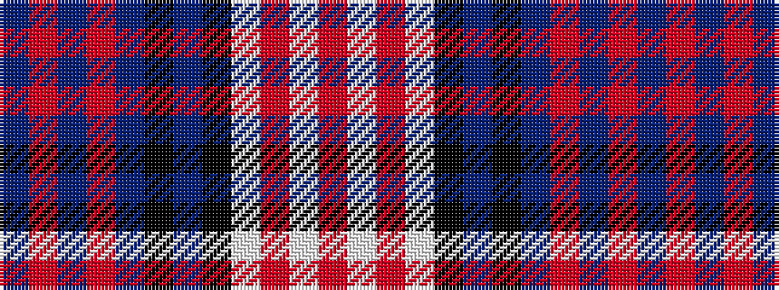

BRBRBKBKWRWR

It is a 12 stripe tartan.

<figure class="pat-woven">

<figcaption>idealised sample</figcaption>
</figure>

## Colour Sequence



## Tartans with this colour sequence

| Tartans |
|---------------|
| [Ross Purple Dress Tartan Tartan Number: 8711. Earliest known date: Threadcount and colours aren't 100% original. Generated manually. See products available Copyright © Blair Urquhart, Comrie, 2015](/setts/s12/dp4m3dp3m4dp4k9dp4k9w26m2w4m2~x2/)|
||
