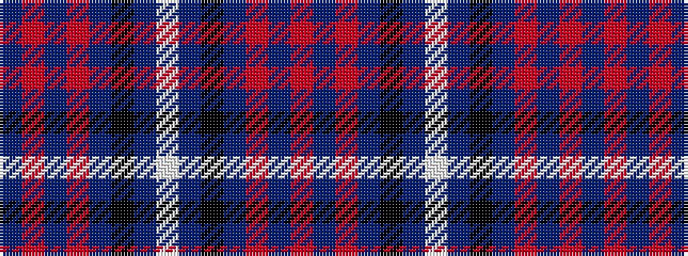

BRBRBKBWBKBRBR

It is a 14 stripe tartan.

<figure class="pat-woven">

<figcaption>idealised sample</figcaption>
</figure>

## Colour Sequence



## Tartans with this colour sequence

| Tartans |
|---------------|
| [Tokyo Bluebells (Dance)](/setts/s14/b18r1b1r1b1k7b13w2~x4/)|
||
