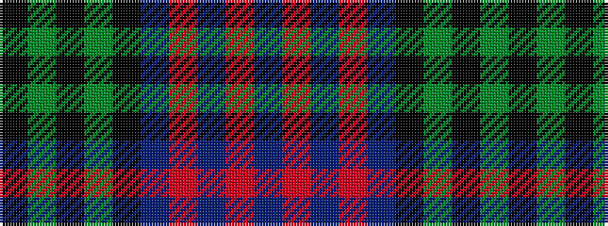

BRBRBKGKGK

It is a 10 stripe tartan.

<figure class="pat-woven">

<figcaption>idealised sample</figcaption>
</figure>

## Colour Sequence



## Tartans with this colour sequence

| Tartans |
|---------------|
| [Park](/setts/s10/db62r1db2r1db4k14g4k2g6k4~x2/)|
||
