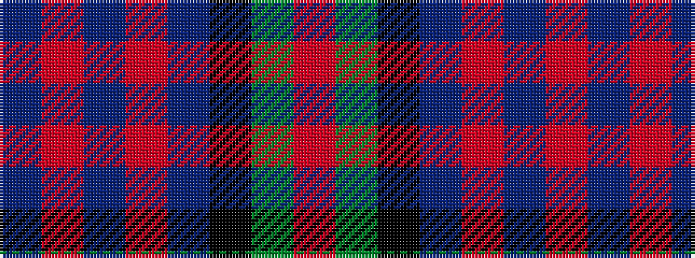

BRBRBKGR

It is a 8 stripe tartan.

<figure class="pat-woven">

<figcaption>idealised sample</figcaption>
</figure>

## Colour Sequence



## Tartans with this colour sequence

| Tartans |
|---------------|
| [Scotch House 2000, original](/setts/s8/db22r3db2r3db2k17dg18o4~x2/)|
||
