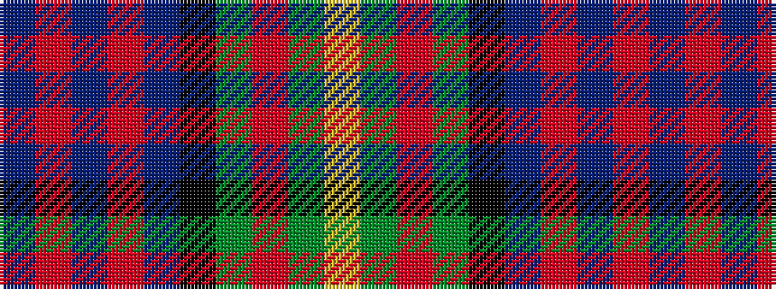

BRBRBKGRGY

It is a 10 stripe tartan.

<figure class="pat-woven">

<figcaption>idealised sample</figcaption>
</figure>

## Colour Sequence



## Tartans with this colour sequence

| Tartans |
|---------------|
| [Lobban (Personal)](/setts/s10/ly5g2r2g12k9t12r2t2r2t2~x2/)|
||
| [Logan, or MacLennan](/setts/s10/db1r1db1r1db4k4g4r1g1ly1~x4/)|
||
