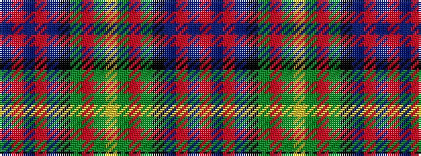

BRBRBKGRGYGRGKBRBR

It is a 18 stripe tartan.

<figure class="pat-woven">

<figcaption>idealised sample</figcaption>
</figure>

## Colour Sequence



## Tartans with this colour sequence

| Tartans |
|---------------|
| [Lobban (Personal)](/setts/s18/r2t2r2t12k9g12r2g2ly5g2r2g12k9t12r2t2r2t2~x2/)|
||
