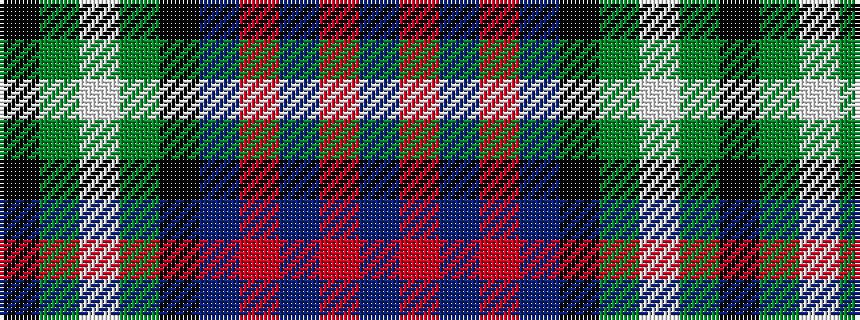

BRBRBKGWGK

It is a 10 stripe tartan.

<figure class="pat-woven">

<figcaption>idealised sample</figcaption>
</figure>

## Colour Sequence



## Tartans with this colour sequence

| Tartans |
|---------------|
| [Parr](/setts/s10/b106r3b4r6b8k28g8lb4g12k8/)|
||
| [Parr](/setts/s10/db62r1db2r1db4k14g4w2g6k4~x2/)|
||
