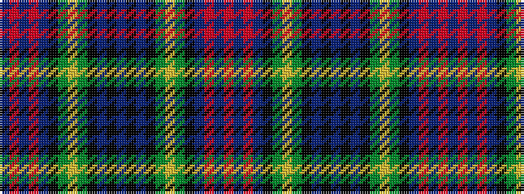

BRBRBKGYGKBKBKBKGYGKBRBR

It is a 24 stripe tartan.

<figure class="pat-woven">

<figcaption>idealised sample</figcaption>
</figure>

## Colour Sequence



## Tartans with this colour sequence

| Tartans |
|---------------|
| [Keith](/setts/s24/b18r5b3r5b3k20g18ly4g18k20b20k6b6/)|
||
| [Keith District District Tartan Tartan Number: 5782. Earliest known date: 2003 Designed by Councillor Linda Gorn of Keith who was instrumental in having a tartan museum established in Keith circa 1998 under the auspices of the Scottish Tartans Society. Keith is also home to Macnaughton Group's weaving mill (Isla Mill). The House of Edgar who formalised this design is also part of the same group. See products available Copyright © Blair Urquhart, Comrie, 2015](/setts/s24/db18r5db3r5db3k20dg18lo4dg18k20db20k6db6/)|
||
