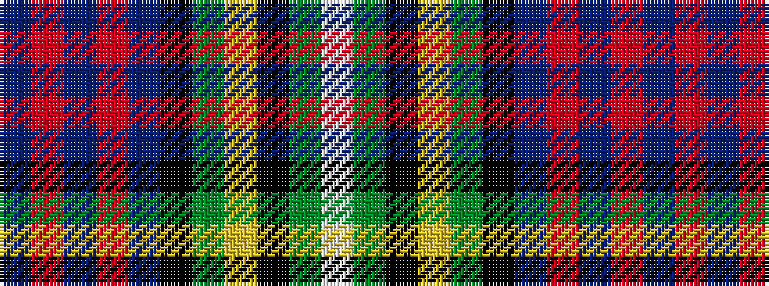

BRBRBKGYKGW

It is a 11 stripe tartan.

<figure class="pat-woven">

<figcaption>idealised sample</figcaption>
</figure>

## Colour Sequence



## Tartans with this colour sequence

| Tartans |
|---------------|
| [Groen (Personal)](/variants/s11/n12r2n3r4n15k24dg18ly1k3dg3w3~x2/)|
||
