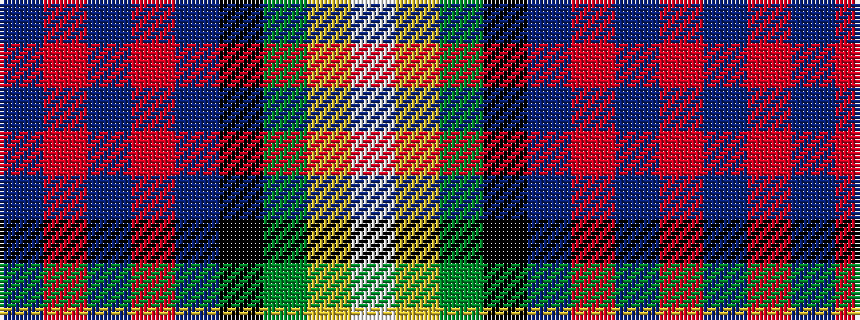

BRBRBKGYW

It is a 9 stripe tartan.

<figure class="pat-woven">

<figcaption>idealised sample</figcaption>
</figure>

## Colour Sequence



## Tartans with this colour sequence

| Tartans |
|---------------|
| [Highland Glen (Corporate)](/variants/s9/t50r3t4r4t7k14g31lo2w2~x2/)|
||
