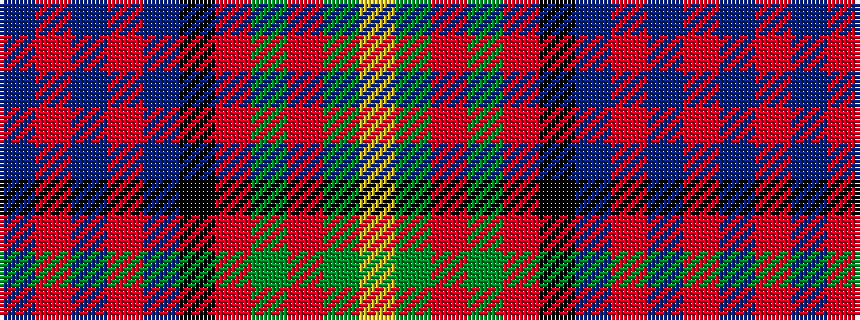

BRBRBKRGRGY

It is a 11 stripe tartan.

<figure class="pat-woven">

<figcaption>idealised sample</figcaption>
</figure>

## Colour Sequence



## Tartans with this colour sequence

| Tartans |
|---------------|
| [Cameron of Erracht (WCWM)](/variants/s11/do10r4do4r4do20k20r3g20r4g4lo4~x2/)|
||
