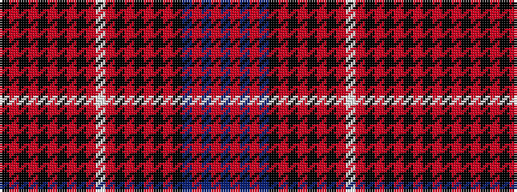

BRBRBKRKRKRKRWRKRKRKRKRK

It is a 24 stripe tartan.

<figure class="pat-woven">

<figcaption>idealised sample</figcaption>
</figure>

## Colour Sequence



## Tartans with this colour sequence

| Tartans |
|---------------|
| [Arran District Tartan Tartan Number: 381. Earliest known date: 1982 The Arran District tartan is a modern sett introduced by MacNaughtons of Pitlochry in 1982. It has recently been produced with a colour modification by Lochcarron Mills in Galashiels. The unusual ever decreasing stripe effect is taken from a pattern book of old plaids found on the Isle of Arran. See products available Copyright © Blair Urquhart, Comrie, 2015](/setts/s24/dp90o5dp5o5dp5k16r3k5r4k4r5k3r6w4r6k3r5k4r4k5r3k16o22k5/)|
||
