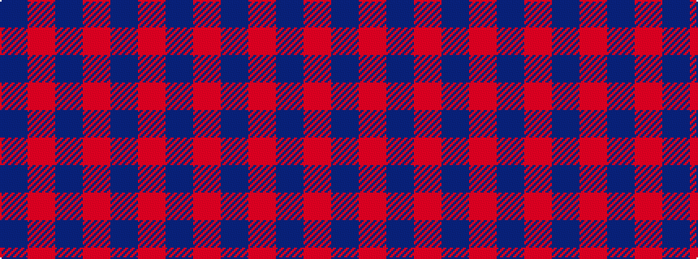

BRBRBR

It is a 6 stripe tartan.

<figure class="pat-woven">

<figcaption>idealised sample</figcaption>
</figure>

## Colour Sequence



## Tartans with this colour sequence

| Tartans |
|---------------|
| [Auburn University (Alabama) (Corp)](/setts/s6/db3o3db24o30db3o2~x2/)|
||
| [Glen Burns (WCWM-2)](/setts/s6/n1o6n6oi6n1oi1~x4/)|
||
| [Harmony, 11](/setts/s6/o6p2o29p29o2p6~x2/)|
||
| [Hebridean 2](/setts/s6/db2r2db15r15db2r2~x2/)|
||
| [MacArthur-Fox, dress](/setts/s6/r2db13ri3db3ri16t2~x4/)|
||
| [MacGregor of Glengyle](/setts/s6/db1r1db7r7db1r1~x4/)|
||
| [Mary Erskine School, The](/setts/s6/dt6r1dt24r28dt1r4~x2/)|
||
