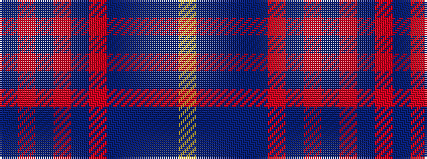

BRBRBRBBBBY

It is a 11 stripe tartan.

<figure class="pat-woven">

<figcaption>idealised sample</figcaption>
</figure>

## Colour Sequence



## Tartans with this colour sequence

| Tartans |
|---------------|
| [NHK Asaichi](/variants/s11/dr2r11dp1r1dp1r1dp4b6dr1b1ly1~x4/)|
||
