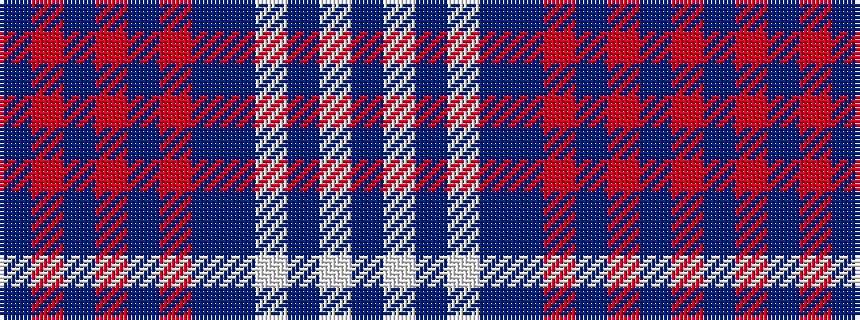

BRBRBRBBWBWB

It is a 12 stripe tartan.

<figure class="pat-woven">

<figcaption>idealised sample</figcaption>
</figure>

## Colour Sequence



## Tartans with this colour sequence

| Tartans |
|---------------|
| [Eidart](/setts/s12/db28r15db27r2db27r3db26n20w3n2w2n4~x2/)|
||
