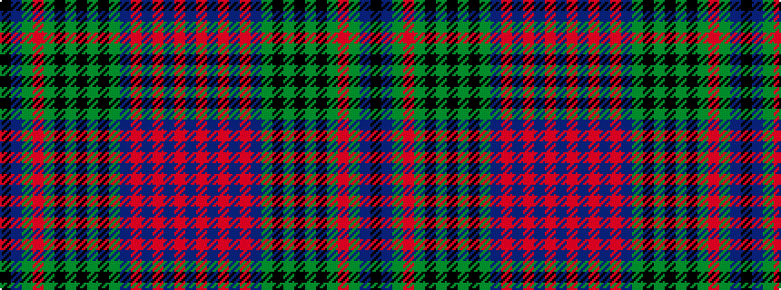

BRBRBRBGKGKGKGRGBK

It is a 18 stripe tartan.

<figure class="pat-woven">

<figcaption>idealised sample</figcaption>
</figure>

## Colour Sequence



## Tartans with this colour sequence

| Tartans |
|---------------|
| [Glasgow, Celtic Society](/variants/s18/db8o3db3o3db3o3db4g4k3g3k3g3k3g13r8g4db3k6~x2/)|
||
