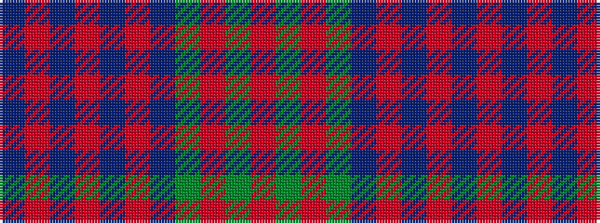

BRBRBRBGRGR

It is a 11 stripe tartan.

<figure class="pat-woven">

<figcaption>idealised sample</figcaption>
</figure>

## Colour Sequence



## Tartans with this colour sequence

| Tartans |
|---------------|
| [McCaslin](/setts/s11/db13r4db4r9db14r4db14g15r8g8r4~x2/)|
||
