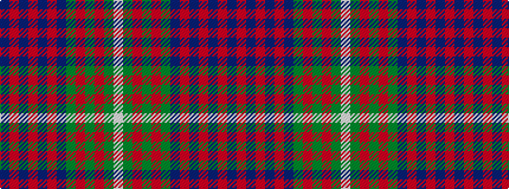

BRBRBRBGRGRGW

It is a 13 stripe tartan.

<figure class="pat-woven">

<figcaption>idealised sample</figcaption>
</figure>

## Colour Sequence



## Tartans with this colour sequence

| Tartans |
|---------------|
| [MacCaslan (Artefact)](/variants/s13/db13r4db4r9db14r4db14g15r8g8r4g8w4~x2/)|
||
