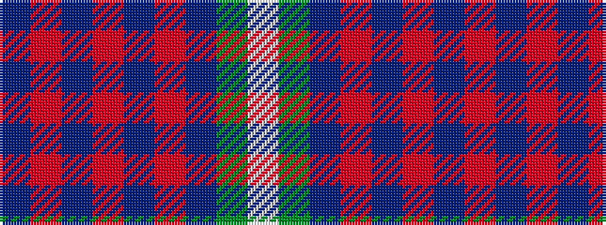

BRBRBRBGW

It is a 9 stripe tartan.

<figure class="pat-woven">

<figcaption>idealised sample</figcaption>
</figure>

## Colour Sequence



## Tartans with this colour sequence

| Tartans |
|---------------|
| [American Soc.of Travel Agents (Corp)](/variants/s9/db2o10db1o1db10r1db10g10w2~x2/)|
||
