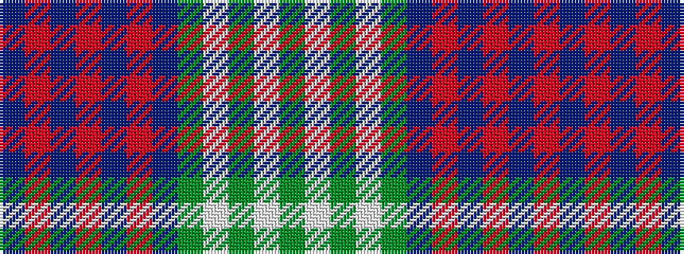

BRBRBRBGWGWG

It is a 12 stripe tartan.

<figure class="pat-woven">

<figcaption>idealised sample</figcaption>
</figure>

## Colour Sequence



## Tartans with this colour sequence

| Tartans |
|---------------|
| [Eidart, Scotch House](/variants/s12/y4w2y2w3y20db6r3db2r2db2r17db3~x2/)|
||
