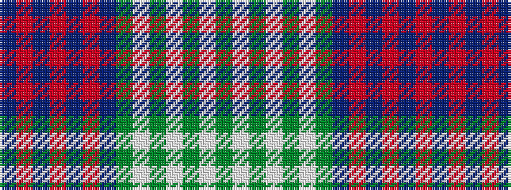

BRBRBRBGWGWGWG

It is a 14 stripe tartan.

<figure class="pat-woven">

<figcaption>idealised sample</figcaption>
</figure>

## Colour Sequence



## Tartans with this colour sequence

| Tartans |
|---------------|
| [Lochaber (Scrapbook)](/variants/s14/do10o2do6o12do2o6do2dy10w2dy6w12dy2w6dy1~x2/)|
||
