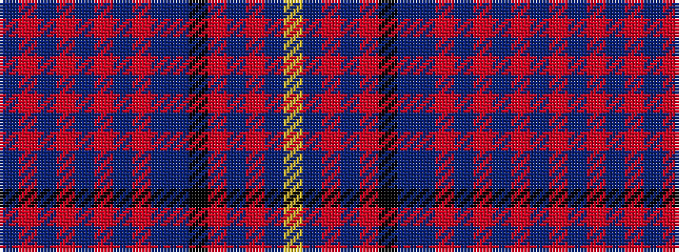

BRBRBRBRBBKRBRBY

It is a 16 stripe tartan.

<figure class="pat-woven">

<figcaption>idealised sample</figcaption>
</figure>

## Colour Sequence



## Tartans with this colour sequence

| Tartans |
|---------------|
| [Dundonald](/setts/s16/db25r3db3r2db4r2db3r3db8db10k16r1db16r3db8ly2~x2/)|
||
