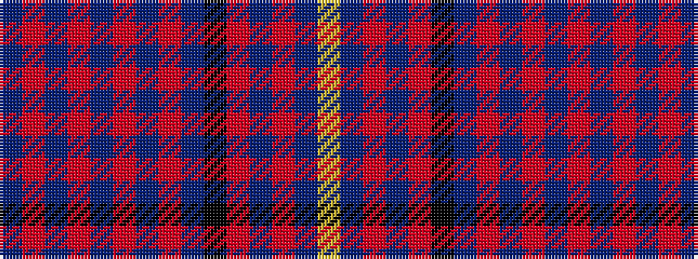

BRBRBRBRBKRBRBY

It is a 15 stripe tartan.

<figure class="pat-woven">

<figcaption>idealised sample</figcaption>
</figure>

## Colour Sequence



## Tartans with this colour sequence

| Tartans |
|---------------|
| [Cochrane Azure](/setts/s15/t27r4t3r2t4r2t3r4t14k14r2db14r4db4ly3~x2/)|
||
