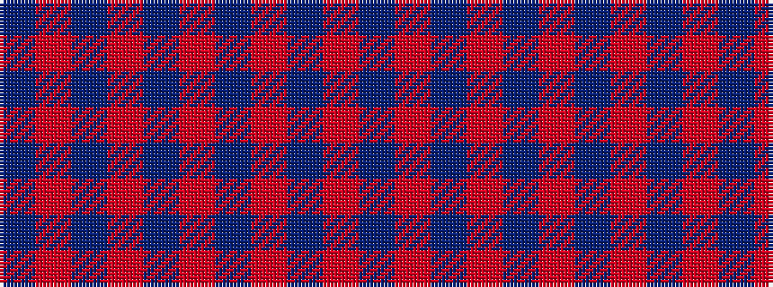

BRBRBRBRBR

It is a 10 stripe tartan.

<figure class="pat-woven">

<figcaption>idealised sample</figcaption>
</figure>

## Colour Sequence



## Tartans with this colour sequence

| Tartans |
|---------------|
| [Hebrides #7](/setts/s10/db2r2db15r15db2r2~x2/)|
||
| [Masai Shuka 06 (Artefact)](/setts/s10/r50dp1r4dp3r8dp15r2dp2r3dp4~x2/)|
||
| [Masai Shuka 23 (Artefact)](/setts/s10/r15db4r1db1r1db1r1db1r1db1~x4/)|
||
| [Prince Charles Edward](/setts/s10/db40r40db44r2db2r40db2r2db2r7~x2/)|
||
