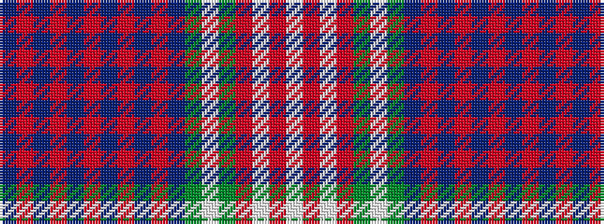

BRBRBRBRBRBGWGRWRW

It is a 18 stripe tartan.

<figure class="pat-woven">

<figcaption>idealised sample</figcaption>
</figure>

## Colour Sequence



## Tartans with this colour sequence

| Tartans |
|---------------|
| [Royal Bahrain (Royal)](/variants/s18/dt16r1dt2r3dt1r9dt1r3dt2r1dt6dg3lb3dg5r28w3r3w3~x2/)|
||
