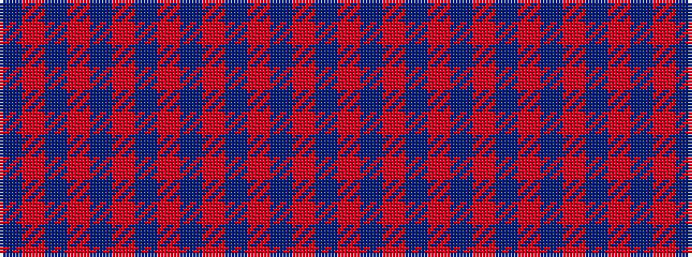

BRBRBRBRBRBRBR

It is a 14 stripe tartan.

<figure class="pat-woven">

<figcaption>idealised sample</figcaption>
</figure>

## Colour Sequence



## Tartans with this colour sequence

| Tartans |
|---------------|
| [Hebridean Cairn](/variants/s14/n18o2n10o3n3o3n2o3n3o3n10o2n18o1~x4/)|
||
